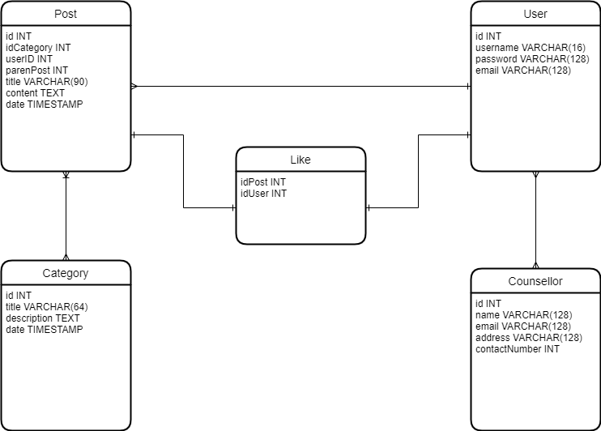
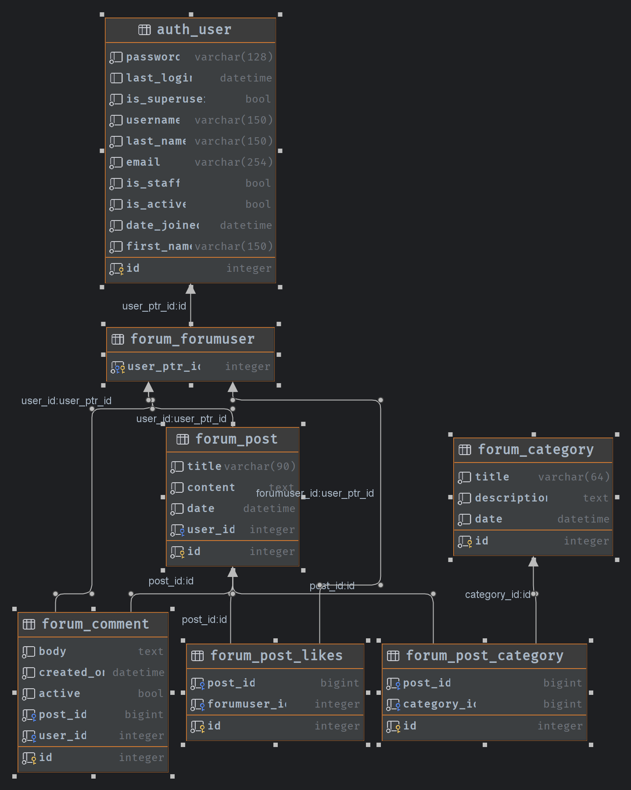

# Oasis

Safe space forum for women in the academe.
# Guide
Html - templates are in forums/templates.

Css - forums/static/css

## Running Tests

Clone the repository.
You should install dependencies.
```shell
pip install -r requirements.txt
```
Then migrate changes:
```shell
python manage.py makemigrations
python manage.py migrate
```
To debug, run the following command

```shell
  python manage.py runserver
```

# Initial Database Schema

# Current Working Database Schema
